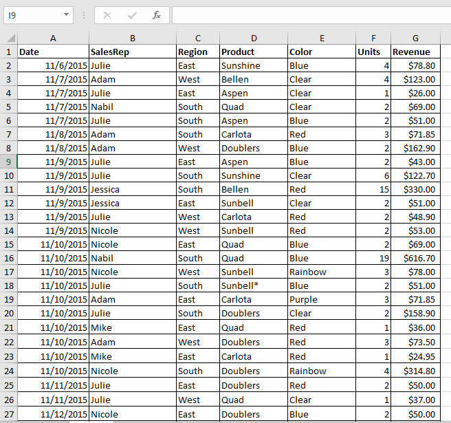
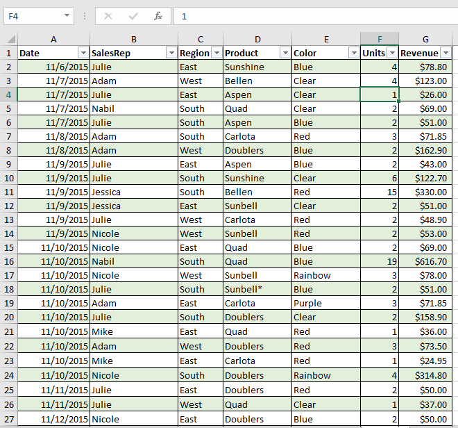

# EaglesTech-Sales-Report- Summary
This report provides an overview of the EaglesTech sales data for the period of [2015-2019]. The data includes [list of items, products and services] sold, the total sales revenue generated, and the number of units sold. The report highlights the top-selling products/services and identifies the trends or patterns in the sales data. 
# Introduction
EaglesTech is one of the fast growing product manufacturing and distribution companies and my first welcoming task by MD is to
create a report for an upcoming board meeting. The project is to clean, analyse, visualize and recommend possible ways to improve the company

**_Disclaimer:_** All dataset and report do not represent any institution or organization but just a dummy dataset to demonstrate the capabilities of Microsoft Excel
# Problem Statement
1. Revenue by region
2. Revenue by sales Rep
3. Revenue by products
4. Sales trend
5. Yearly changes in revenue
6. Top 3 products
7. The most productive sales Rep in the respective years.
8. 3 recommendations you think would help the company increase revenue in the following year.

# Skills/concept demonstrated
1. Data cleaning
2. pivot chart and pivot table
3. Colour psychology
4. Data visualization
# Problem Approach
- I clean, remove duplicate and empty rows from the dataset
- I created pivot chart to answer each question
- I created an executive slicer to enable stakeholder filter each  region
- I transformed raw dataset from Excel files and designed interactive reports and dashboards to complete the task.
Raw dataset-uncelan & messy        | Standard Excel worksheet, clean and ready for visualization
  :-------------------------------:|:---------------------------------:
             |         
  
  
